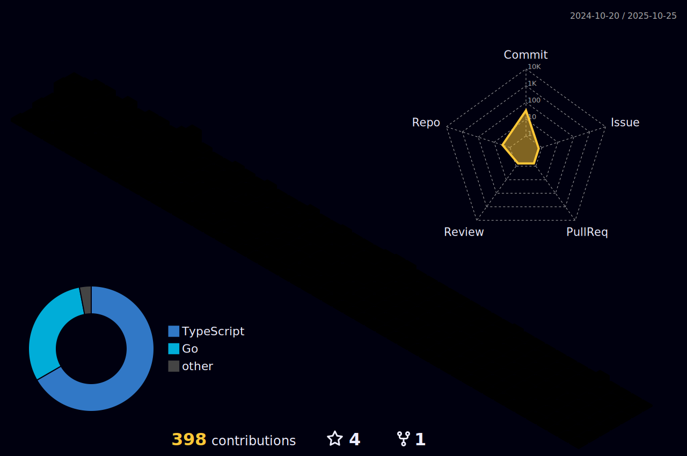

## Hi there 👋
Let's get straight to it: **programming languages**? Oh boy, they're like flavors of ice cream - I just can't pick a favorite! 🍦 But you know what? **Python** and **Go** definitely have a special place in my heart.

Now, what do I do? Well, I wear multiple hats in the tech world. You can call me a **Software Engineer**, a **Cybersecurity Analyst & Developer**, a **Machine Learning Developer**, and even a **Data Scientist** when the stars align? 😄. It's a juggling act, but hey, I love a good challenge!

When it comes to your precious data, fret not, my friend. Protecting it is my bread and butter 🍞, my raison d'être! And let me tell you a little secret: I live and breathe for **CTF** challenges. It's like a never-ending adventure for me!

But hey, I'm not just here for myself. I'm all about helping others achieve their goals too. I'm here to provide **cutting-edge solutions**, helping you conquer your objectives and reach **new heights**. Together, we'll make technology our playfield! 🚀

Oh, and did I mention that I despise wasting time? Life's too short for that, my friend! I'm always on the hunt for new knowledge and skills. Every single day, I strive to learn something new, expand my horizons, and keep up with the ever-evolving tech landscape. It's like a thrilling treasure hunt, but instead of gold, I find knowledge nuggets! 💡

Sincerely,
  
**Your lovely tech wizard** 🧙‍♂️

